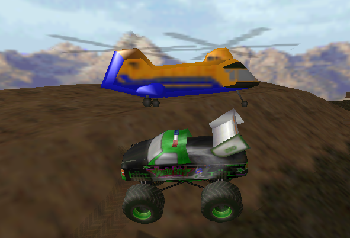

# BIN File Format v1.1 by Oliver Pieper

*Version*: v1.1

*Author*: Oliver Pieper

*Email*: [pieper@viaregio.de](mailto:pieper@viaregio.de)

*WWW*: [www.oliverpieper.de](http://www.oliverpieper.de)

*Revision history*:
 
 * **In bold**: Any additions after 1999-11-27 by Stefan Teitge and Chuck Ritola
 * 1999-11-27 v1.1 - Added Fly! to the list of games using BIN models; changed Texture Block struct in 3.6.1 (now 16-byte string instead of 12-byte string + 4-byte unknown value); added the Face Type 0x34 in 3.8.1 (thanks to Guitar Bill for the infos!). Revised my "educated" guess in 3.7.1. Some other minor corrections.
 * 1999-11-21 v1.0 - Put all the info from my old and unstructured "BIN File Format.txt" and "animated bin.txt" and the ReadBIN()-Function of BINedit together.

## 0. About this file

This file contains all the info I've gathered concerning the BIN file format used by Terminal Reality Inc. (TRI) in the games Monster Truck Madness 1 & 2 (MTM1, MTM2), CART Precision Racing (CPR), Hellbender, and Fly!. BINs are the 3D models used in these games.

This information has been gathered by reverse engineering the BIN files and has been used for my BIN file editor BINedit. The focus of this work has always been MTM, so you might be in for a surprise or two when you are working with Hellbender, CPR, or especially Fly! models.

If you discover anything new about BIN files, please send me the info and I will try to keep this document up to date.

## 1. Data format

Except for the (zero terminated) strings, all data in the BIN file consists of four byte signed integer values that are stored in the "little endian" format used by all Intel machines. Little endian means that the least significant byte is stored first. The four bytes 0x11 0x22 0x33 0x44 (or short: 11 22 33 44) in a file represent the number 0x44332211, not 0x11223344 as one might expect. I usually read the values by reading 4 bytes directly into a four byte integer variable. That way, no conversion is necessary.

## 2. General info

There are many values called "unknown" in the data structures below. Allmost all of them are not really "unknown" but seem to be unused and are zero most of the time. I've decided to call them "unknown" just to be on the safe side...

This document contains all the info on BIN files that is used by my BIN file editor BINedit. All the "unknown" values are not read when opening a BIN and are written as zero (unless something else is said below) when writing a BIN, with no known side effects.

The term #variable_name in this file should be read as "the value stored in the variable called variable_name".

**256 model units are equivalent to 1 foot in reality.**

## 3. File format

### 3.1 ID number

The BIN file starts with a four byte ID number.

```c
int bin_id;
```

The value bin_id is 0x14 for MTM BIN files and 0x20 for "animation control" files. Animation control files also use the extension .BIN, but are a totally different file type. They are covered at the end of this text.

I'm not sure which values are used by Hellbender and Cart Precision Racing BINs. My program BINedit will issue a warning if a BIN file does not start with 0x14, but will attempt to load it anyway.

Examples:
```c
14 00 00 00 - regular MTM BIN file
20 00 00 00 - regular animation control BIN file
```

### 3.2 BIN header
Following the ID number are 16 bytes (four 4 byte values) of a header structure.
```c
struct binheader {
	int bin_scale;
	int bin_unknown1;	// usually 0x2
	int bin_unknown2;	// usually 0x0
	int bin_vert_num;
};
```

Bin_scale is 00 00 01 00 (0x10000) for all MTM BINs. There are different values in Hellbender BINs. They seem to affect the size of the model.

The function of bin_unknown1 and bin_unknown2 is, well... unknown. The usual values for MTM are bin_unknown1=2 (02 00 00 00), bin_unknown2=0 (00 00 00 00). The last value bin_vert_num is the number of vertices of the model.

Example:
```c
00 00 01 00 - "normal" MTM scale
02 00 00 00 - unknown
00 00 00 00 - unknown
00 01 00 00 - 0x100 (=256) vertices
```

### 3.3 Vertex coordinates

Now that we know the number of vertices bin_vert_num, we can read the next portion of the BIN file, which consists of three times four bytes for each vertex.
```c
struct vertex {
	int x;
	int y;
	int z;
};
```
The three integer values are the x-, y-, and z-coordinate of the vertex. Negative values are possible.

### 3.4 Data blocks

The first part of all BINs (ID, header, vertex coordinates) is present in all MTM bin files. What follows is a variable sequence of "Data Blocks" where the first four-byte value of each block determines what kind of data comes after it.

```c
int block_id;
```

If you encounter a new kind of block_id in a BIN file, your only option is to break out your hex editor and try to figure out how long it is (i.e. where the next block starts) and what it does. In many cases, you'll probably simply ignore the block until you've got an idea of what it might do.

### 3.5 Misc Blocks (0x03, **0x16**, 0x17)

#### 3.5.1 Block 0x03 (MTM2 Vertex Normals)

**The block starts with two integers of unknown use. Then it is followed by the normals as described below.**

Block_id 0x03 has so far only been encountered in MTM2 BINs. It is similar to the vertex coordinates at the beginning of the BIN file, and as far as I can recall, it always follows immediately after it. The block consists of three four-byte values for each vertex.

```c
struct vertex_normal {
	int nx;
	int ny;
	int nz;
};
```

The three values are the x-, y-, and z-component of the normal vector of the vertex. MTM2 needs this value for the Gouraud Shading of the "shiny" truck textures.

=== 3.5.2 Block 0x16 (Line Segment Block)

**The block_id 0x16 precedes a Line Segment Block. The block consists of 3 components plus header:**

 * uint32 Block 0x16 header
 * uint32 colorIndex
 * uint32 vertexID1
 * uint32 vertexID2

**... where colorIndex, when a value of 16 is added, likely points to the color index of the current planet's palette for which to draw this segment.**

**....where vertexID is an index referring to the BIN file header's common vertex list.**

**This is used in the domm.bin files referred by WATER.LVL of the Fury3 POD.**

**The vertices used in this block are subject to the same bin_scale that applies to face blocks.**


#### 3.5.3 Block 0x17 (Hellbender, unknown)

This block_id is followed by 8 bytes (probably two four-byte values) of unknown purpose.

### 3.6 Texture blocks (0x0D, 0x1D)

#### 3.6.1 Block 0x0D (Texture block)

The block_id 0x0D precedes a Texture Block. The block contains the name of the texture that is to be used for all the following faces (until another Texture Block 0x0D or 0x1D is found).

```c
struct texture_block {
	int tb_unknown1;
	char tb_tex_name[16];
};
```

The first four bytes (tb_unknown1) after the block_id are always zero. Next comes a 16-byte string containing the texture name.

#### 3.6.2 Block 0x1D (Animated Texture block)

A block with the ID 0x1D describes a Texture Animation that is to be used for all the following faces (until the next block 0x0D or 0x1D is read).

```c
struct anim_texture_header {
	int at_unknown1;
	int at_num_textures;
	int at_unknown2;
	int at_delay;
	int at_unknown3;
	int at_unknown4;
};
```

A Texture Animation is actually a slide show of textures. At_num_textures is the number of "frames" in the animation, while at_delay determines the frame rate. At_delay is calculated as 65535/frames_per_second.

The anim_texture_header structure is followed by #at_num_textures filenames, all 32 byte long:

```c
char at_tex_name[32];
```

### 3.7 Color blocks (0x0A) ==

#### 3.7.1 Block 0x0A ===

(Thanks to GuitarBill for the info on 0x0A and 0x19!)

The block_id 0x0A is followed by only one four-byte value. Those blocks precede special Face Blocks of type 0x19, and Bill suspects that the value defines a color for uniformly colored faces.

```c
struct color_block {
	BYTE	cb_byte1;
	BYTE	cb_byte2;
	BYTE	cb_byte3;
	BYTE	cb_byte4;
};
```

All the 0x0A blocks encountered so far seem to be all zero. BINedit simply ignores the 0x0A block and continues using the last texture, which works quite well, but is probably not the right way to handle it...

This is just an educated guess, but if I had to store a RGB color value in the color_block structure, I would store the integer value 0x00RRGGBB where RR, GG, and BB are the hex values of the red, green, and blue component respectively. In other words: cb_byte1 holds the blue component, cb_byte2 the green, cb_byte3 the red, and cb_byte4 is zero.

### 3.8 Face Blocks (0x0E, 0x11, 0x18, 0x19, 0x29, 0x33, 0x34) ==

#### 3.8.1 Block 0x0E, 0x11, 0x18, 0x29, 0x33, 0x34 ===

Those Face Blocks (except for 0x19) all use an identical structure and thus can be handled in the same way. It is important to store the block_id (the block_ids of Face Blocks are also called "Face Types" by BINedit)  itself, too, because it affects the way the face is displayed in MTM, Hellbender, CPR or Fly!:

    * 0x0E - unknown
    * 0x11 - color #0 in texture is transparent in MTM1, strange effects in MTM2
    * 0x18 - color #0 not transparent (most common MTM1 and MTM2 face type)
    * 0x29 - MTM2 shiny texture, color #0 not transparent (used, for example, for the trucks)
    * 0x33 - color #0 in texture is transparent in MTM2 (like 0x11 in MTM1)
    * 0x34 - used in MTM2 Arena BINs

The block_id is followed by a header structure with general information on the face:

```c
struct face_block_header {
	int fb_num_vertices;
	inf fb_normal_x;
	inf fb_normal_y;
	inf fb_normal_z;
	int fb_magic;
};
```

Fb_num_vertices is a four-byte integer value with the number of vertices of the face. Only the values 0x3 and 0x4 for three- and four-sided faces have been encountered so far.

The next three integer values are the three components of the surface normal vector of the face. The vector is always normalized to a length of 65535.

Fb_magic was the hardest to figure out. It is the vector product of the normal vector and the coordinates of the first vertex of the face, and it has a significant effect on how the BIN model is drawn in MTM. Wrong values will result in randomly appearing and disappearing faces.

One noteable exception for fb_magic: if the BIN is used as backdrop model, the value has to be 0x80000000.

For each of the #fb_num_vertices vertices follows a vertex block:

```c
struct vertex_block {
	int vb_vertex_index;
	int vb_tex_coord_u;
	int vb_tex_coord_v;
};
```

Vb_vertex_index is an index into the Vertex Coordinates at the beginning of the BIN file, starting with index 0 for the first vertex coordinate triplet, and so on.

The two vb_tex_coord values map the vertices of the face to the texture. They are both in the range of 0x0 to 0xFF00, with u=0x0, v=0x0 being the upper left corner of the texture, and u=0xFF00, v=0xFF00 being the lower right corner.

#### 3.8.2 Block 0x19, **0x05**

(Thanks to GuitarBill for the info on 0x0A and 0x19!)

Block 0x19 **and 0x05** is a special Face Type that follows after Color Blocks of type 0x0A. The header format is identical to that of the other Face Types, i.e.

```c
struct face_block_header_0x19 {
	int fb19_num_vertices;
	inf fb19_normal_x;
	inf fb19_normal_y;
	inf fb19_normal_z;
	int fb19_magic;
};
```

(see "Block 0x0E, 0x11, 0x18, 0x29, 0x33" for explanation), but the Texture Coordinates are missing from the vertex info blocks:

```c
int vb19_vertex_index;
```

### 3.9 Rotor Block 0x02



**HIGHLY SPECULATIVE: As this block occurs twice and an only in MTM2's _heli.bin_ describing the rescue helicopter. I suppose the follwing: Each block describes one of the rotors.**

**This blocks' size is 136 byte. It can be found twice im MTM2's _heli.bin_. The supposed structure is as follows.**

 * **4 bytes always zero**
 * **an int describing a number of vertexes (numVertexes)**
 * **numVertexes vertexes (12 byte per vertex as described in 3.8.1)**
 * **80 bytes of unknown purpose**

### 3.10 Block 0x12

**The length of this block is 4 byte. Found in MTM1 _heli.bin_and TV _models\helicopt.bin_**

### 3.11 Block 0x0C

**The length of this block is 24 byte. Found in MTM1 _heli.bin_ and TV _models\helicopt.bin_**

### 3.12 Block 0x00

A block_id of 0x00000000 marks the end of a BIN file.

## 4. Animation Control BIN files

Animation control BINs define a BIN animation, i.e. a BIN with an animated shape. It does not contain any model data itself, but contains the names of the BIN files used for the animation. Those files must be identical in every aspect except for the position of the vertices (and data that depends on it, like the normal vectors). The animated BIN will smoothly "morph" from the shape of the first BIN to the next, and so on. In the end it will morph from the last shape into the first and the cycle starts again.

Animation Control BIN files start with a four byte ID number
```c
int bin_id;
```
of 0x20, followed by a structure of fixed length:

```c
struct anim_control {
	int ac_unknown1;	// always zero
	int ac_num_frames;
	int ac_delay;
	int ac_unknown2;	// always zero
	int ac_unknown3;	// always zero
	char ac_binfile01[16];
	char ac_binfile02[16];
	char ac_binfile03[16];
	  <..and so on...>
	char ac_binfile29[16];
};
```

Ah_num_frames is the number of different shapes that define the morphing of the shape. Ah_delay defines the speed of the animation and is calculated as 65536/frames_per_second. The first #ac_num_frames of the ax_binfile??-strings contain the names of the animation stages. Unused strings are all zero.

_©1999 Oliver Pieper. Please send all comments and questions to [pieper@viaregio.de](mailto:pieper@viaregio.de). Permission to copy and modify this document is granted, as long as I am given proper credit for my work._